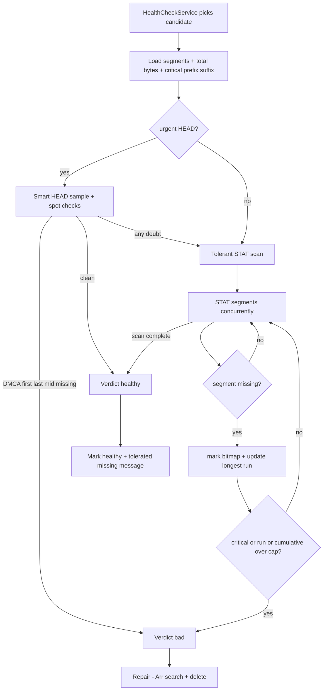

# Health Check Tolerance & Fail-Fast Plan

## Goal

Make the health check:

1. Decide "bad" **as quickly as possible** and **stop checking** once bad is confirmed.
2. **Only** consider a file bad when it is damaged enough that it **won't play properly** —
   a single part/segment missing from a large file must be treated as fine.
3. When confirmed bad, run the **existing [`Repair()`](backend/Services/HealthCheckService.cs:758)**
   flow (Arr replacement search + delete where needed) — unchanged.

## Decision: consecutive gaps, tier caps, plus a cumulative backstop

### Why not a percentage

5% of a video is hundreds to thousands of missing segments (≈500 MB on a 10 GB file). The streaming
layer zero-fills missing segments and hard-truncates long before that, so a percentage threshold
would mark clearly-unplayable files "healthy".

### Why "in a row" (consecutive) is the primary signal

H.264/HEVC/AV1 decoders resync at keyframes (IDR frames): a hole corrupts the picture only up to
the next keyframe. Damage is therefore proportional to the **length of a contiguous gap**, not the
total count of missing segments:

- A contiguous run of N segments destroys N segments of continuous content (seconds of video).
- Scattered single-segment holes each corrupt ~one GOP and recover independently — a few scattered
  holes are barely noticeable.

### Why a cumulative backstop is still needed

A pure consecutive rule misses "rolling takedowns" that remove scattered articles (every Nth
article) rather than a contiguous range. Such a file has no long run but is riddled with holes, so a
**lenient cumulative cap (4× the tier cap)** catches it without over-removing files that merely have
a handful of scattered glitches.

### Tier caps (file-type aware)

Reuse the streaming layer's `ContainerFragilityTier` (shared via
[`ContainerFragilityTierResolver`](backend/Services/ContainerFragilityTier.cs:29)):

- `Resilient` (MKV/WebM/MPEG-TS/fragmented MP4): consecutive cap = configured (default 3),
  cumulative cap = 12.
- `Standard` (MP4/MOV/AVI/WMV/FLV): consecutive cap = min(configured, 2), cumulative cap = 8.
- `Unknown` (unknown/non-video/moov-at-end): consecutive cap = 0, cumulative cap = 0 — any missing
  segment is bad.

The configured cap is `usenet.max-graceful-degradation-segments` (env
`MAX_GRACEFUL_DEGRADATION_SEGMENTS`, default 3) — the same knob the streaming layer uses.

## Badness rule

A file is **bad** if any of:

1. a missing segment lands in the **critical header/footer region** (first/last segment, or any
   segment inside the first/last part of a multipart file);
2. the **longest run of consecutive missing segments exceeds the tier's consecutive cap**;
3. the **total number of missing segments exceeds the cumulative backstop** (4× tier cap).

Otherwise it is **healthy** (a few scattered mid-file holes are tolerated).

## Fail-fast

During the scan, missing indices are marked in a bitmap. The moment any of the three conditions
above is met, the scan **cancels** the remaining in-flight checks and returns a bad verdict.

## Flow

## File changes

- [`backend/Services/ContainerFragilityTier.cs`](backend/Services/ContainerFragilityTier.cs:1) —
  shared `ContainerFragilityTier` enum + `ContainerFragilityTierResolver.Resolve(mediaInfoJson)`,
  extracted from `BufferedSegmentStream` so streaming and health check share one rule.
- [`backend/Services/HealthCheckThreshold.cs`](backend/Services/HealthCheckThreshold.cs:36) —
  `EffectiveMaxMissingSegments` (tier cap), `EffectiveCumulativeMissingSegments` (4× backstop),
  `IsCriticalIndex`, `ConsecutiveRunAt`, `IsBad`, byte estimation.
- [`backend/Clients/Usenet/UsenetStreamingClient.cs`](backend/Clients/Usenet/UsenetStreamingClient.cs:367) —
  `CheckSegmentsHealthAsync` with tolerant STAT scan, bitmap run tracking, and fail-fast; HEAD
  smart-sample fast path and DMCA confirmation preserved.
- [`backend/Services/HealthCheckService.cs`](backend/Services/HealthCheckService.cs:497) —
  `PerformHealthCheck` resolves the tier from `DavItem.MediaInfo`, computes both caps, and only runs
  `Repair()` on a bad verdict; `GetAllSegments` returns critical prefix/suffix counts.
- [`backend/Streams/BufferedSegmentStream.cs`](backend/Streams/BufferedSegmentStream.cs:230) — now
  delegates tier resolution to the shared resolver, and the graceful-degradation truncation uses the
  same rule as the health check (truncate when the longest consecutive run exceeds the tier cap, or
  the total zero-filled count exceeds the 4× cumulative backstop) via
  [`RecordCorruptedSegment()`](backend/Streams/BufferedSegmentStream.cs:2232).
- [`backend.Tests/HealthCheckThresholdTests.cs`](backend.Tests/HealthCheckThresholdTests.cs:12) —
  tests for tier→cap mapping, cumulative multiplier, run-length logic, verdicts, and container
  classification.

## Acceptance criteria

- A file with ≤ tier-cap scattered mid-file holes is marked healthy.
- A file with a contiguous run longer than the tier cap is bad.
- A file with total missing beyond the cumulative backstop is bad.
- A missing first/last segment (or a segment inside the first/last part of a multipart file) is
  always bad.
- Confirmed-bad files still flow through the existing `Repair()` (Arr search + delete).
