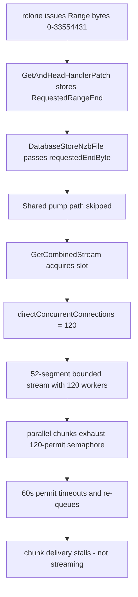

# Plan: rclone Range-Streaming Stall + SQLite Variable Limit

## Symptoms

1. Playback through an rclone vfs-cache mount stalls / does not stream.
2. Backend logs:

```json
{"level":"warn","source":"backend","message":"[BufferedStream] PREFETCH WINDOW: 120 segments (1.0x of 120 connections, source=\"parallelism-floor\", avgSeg=699KB, bufferSegmentCount=240), holds~35MB data (bound=\"segments\", effective=52 of 1865 segments), Job=\"/content/tv/.../....mkv\""}
```

3. A separate error appears during filesystem sync:

```
Microsoft.Data.Sqlite.SqliteException (0x80004005): SQLite Error 1: 'too many SQL variables'.
   at NzbWebDAV.Utils.OrganizedLinksUtil.SyncLinksAsync(ConfigManager configManager, CancellationToken ct) in /backend/Utils/OrganizedLinksUtil.cs:line 249
```

## Root Cause 1: rclone Range chunks spawn full 120-worker streams

Confirmed setup: rclone vfs-cache mount, 32 MB chunked reads, `usenet.total-streaming-connections = 120` (`TOTAL_STREAMING_CONNECTIONS`).

### What the warning actually says

- `effective=52 of 1865 segments` is the key field. It means this stream was constructed with a bounded end, not a full-file stream.
- rclone issues a closed `Range: bytes=0-33554431` (a 32 MB chunk). The handler propagates the range end, and prefetch is bounded to the segment containing that end byte plus 4 segments of overshoot. That is 52 segments out of the file's 1865.
- `source=parallelism-floor` means the byte budget (48 MB per stream on a 512 MB heap) converts to ~68 segments, which is below the 120-connection parallelism floor, so the window is raised to 120 segments.
- `bound=segments` means the actual hold is limited by the 52-segment range end, not by the 120-segment window (~35 MB).

### Why it stalls

The chain is:

1. [`GetAndHeadHandlerPatch.cs`](backend/WebDav/Base/GetAndHeadHandlerPatch.cs:56) stores `RequestedRangeEnd` for the closed range.
2. [`DatabaseStoreNzbFile.cs`](backend/WebDav/DatabaseStoreNzbFile.cs:149) passes it as `requestedEndByte`.
3. [`NzbFileStream.cs`](backend/Streams/NzbFileStream.cs:232) converts it to `endSegmentIndexInclusive`.
4. [`BufferedSegmentStream.cs`](backend/Streams/BufferedSegmentStream.cs:645) sets `effectiveCount = 52`, so the stream fetches only 52 segments and ends cleanly.
5. Because `RequestedRangeEnd` is set, the shared-stream pump path is deliberately skipped in [`NzbFileStream.cs`](backend/Streams/NzbFileStream.cs:354), so each 32 MB chunk opens a brand-new direct `BufferedSegmentStream`.
6. In [`NzbFileStream.GetCombinedStream()`](backend/Streams/NzbFileStream.cs:463), when a buffered-stream slot is acquired, `directConcurrentConnections` is set to the full `_concurrentConnections` value (120) even for a 52-segment bounded read. Only the no-slot fallback path clamps workers to 4.
7. rclone runs several chunks ahead in parallel, so multiple 120-worker streams compete for the 120-permit semaphore, and each stream also tries to use far more NNTP connections than the provider actually allows. Workers wait up to 60 s for permits, time out, and re-queue segments, which stalls chunk delivery.

The warning line is the observable symptom: a 52-segment chunk spinning 120 workers.



## Root Cause 2: SQLite variable limit in organized-links sync

In [`OrganizedLinksUtil.SyncLinksAsync()`](backend/Utils/OrganizedLinksUtil.cs:249), the full list of distinct `DavItemId` values from the disk scan is passed to `dbContext.Items.Where(x => davItemIds.Contains(x.Id))`. EF Core translates `Contains` to `IN (...)` with one SQL parameter per id. SQLite caps the number of bind variables per statement (`SQLITE_MAX_VARIABLE_NUMBER`), so a large library makes this query throw `too many SQL variables`.

## Fix Plan

### 1. Cap workers for bounded Range reads (primary streaming fix) — DONE

Implemented in [`ResolveDirectBufferedStreamParameters()`](backend/Streams/NzbFileStream.cs:282), called from the [`GetCombinedStream()`](backend/Streams/NzbFileStream.cs:507) path. Bounded reads (`_requestedEndByte.HasValue`) are treated as small reads regardless of slot availability:

- Bounded reads do not spend a scarce full buffered-stream slot.
- `directConcurrentConnections` for bounded reads is clamped to a small worker set of ≤4, with `directBufferSize` sized accordingly.
- The unbounded full-file path is unchanged so whole-file streams still use the configured connection count.

Expected effect: each 32 MB rclone chunk uses a handful of workers instead of 120, so parallel chunks no longer exhaust the permit semaphore or the provider's connection pool.

### 2. Regression test for bounded range reads — DONE

[`backend.Tests/NzbFileStreamWorkerResolutionTests.cs`](backend.Tests/NzbFileStreamWorkerResolutionTests.cs:1) covers both slot-acquired and no-slot cases (7 passed).

### 3. Chunk the DavItem ID validation query — DONE

Implemented in [`ChunkDavItemIds()`](backend/Utils/OrganizedLinksUtil.cs:348): `davItemIds` is split into batches of at most 800 and one `Contains` query runs per batch, merging results into a single `HashSet<Guid>`. This keeps the query under SQLite's variable limit regardless of library size.

### 4. Regression test for the ID chunking — DONE

[`backend.Tests/OrganizedLinksUtilChunkingTests.cs`](backend.Tests/OrganizedLinksUtilChunkingTests.cs:1) validates a synthetic id set larger than the SQLite variable limit produces a complete valid-id set without throwing (5 passed).

### 5. Oversubscription warning — DONE

[`StreamingConnectionLimiter`](backend/Services/StreamingConnectionLimiter.cs:49) now logs a warning when `usenet.total-streaming-connections` exceeds the provider's total pooled connections, since workers above that number can never run concurrently and only create permit contention.

### 6. Documentation / configuration guidance — DONE

`usenet.total-streaming-connections` should match the provider's real connection limit (typically 20-50), not a large value like 120 — especially for rclone vfs-cache / Plex, where range-based clients fan out parallel chunks and each chunk now uses a small worker set.

## Implemented

- **Streaming fix**: [`backend/Streams/NzbFileStream.cs`](backend/Streams/NzbFileStream.cs:282) — bounded reads no longer acquire a slot and use ≤4 workers via `ResolveDirectBufferedStreamParameters`; tests in [`backend.Tests/NzbFileStreamWorkerResolutionTests.cs`](backend.Tests/NzbFileStreamWorkerResolutionTests.cs:1) (7 passed).
- **SQLite fix**: [`backend/Utils/OrganizedLinksUtil.cs`](backend/Utils/OrganizedLinksUtil.cs:348) — `ChunkDavItemIds` batches of 800; tests in [`backend.Tests/OrganizedLinksUtilChunkingTests.cs`](backend.Tests/OrganizedLinksUtilChunkingTests.cs:1) (5 passed).
- **Oversubscription warning**: [`backend/Services/StreamingConnectionLimiter.cs`](backend/Services/StreamingConnectionLimiter.cs:49) — logs a `Log.Warning` when `usenet.total-streaming-connections` exceeds the provider's pooled connections.

## Verification

- Streaming and SQLite fixes verified by their regression tests (7 + 5 passed).
- The oversubscription warning is emitted at `StreamingConnectionLimiter` initialization; start the backend with `TOTAL_STREAMING_CONNECTIONS` above the provider's pooled connection limit to confirm it appears.
- Reproduce with rclone vfs-cache: stream the same item and confirm the log no longer shows `1.0x of 120 connections` for a 52-segment chunk, and playback keeps up.
- Confirm the `too many SQL variables` error is gone after a library sync with a large link set.
